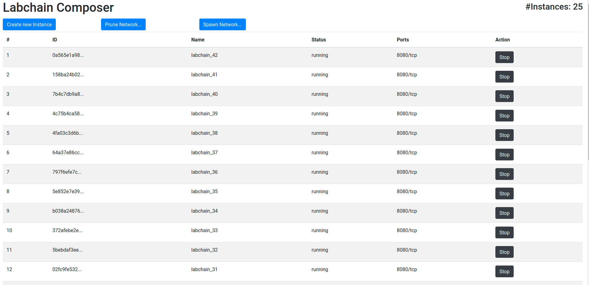
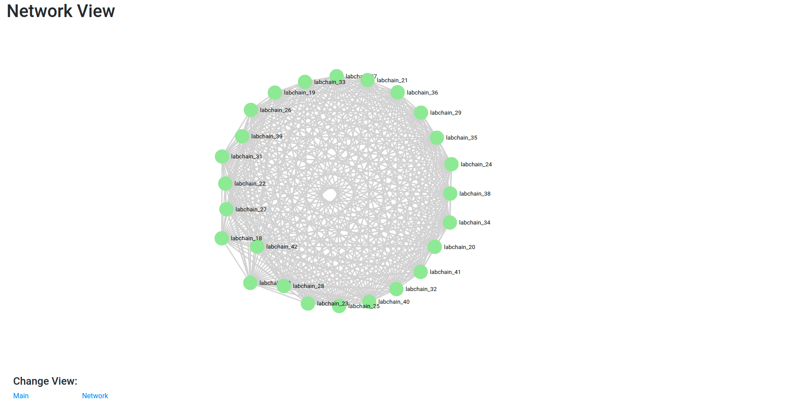

# LabChain Network Composer

The LabChain network composer is a web-based GUI component heavily relying on docker, that provides the following features:

- Spawning networks of arbitrary sizes locally (at some point your machine overburdened)
- Measures the connectivity. What node is connect to what other nodes?
- Easy application of benchmarks.
- Benchmarks can be queued. The benchmark logs are stored into file and can be evaluated.

The general idea is to provide a benchmark application that can easily be executed to measure the performance continuously during
development.

## Screenshots

### Instance Overview



### Network View



By hovering over a node you see the established connections to other nodes.

## Usage

One requirement is that you have installed _docker_ and that you can execute docker as non-root user

`sudo usermod -aG docker $USER` on Ubuntu

### Using Docker

Build the docker container of the network composer

```
cd composer
docker build -t labchain_network_composer:latest .
```

Configure the `HOST_NAME` and the `BECHMARK_DIR` variable in the `composer/docker-compose.yml` file.

Start the container:

```
cd composer
docker-compose up
```

### Starting without docker

Start the network composer by:

```
cd composer
pip3 install -r requirements.txt
python3 composer.py
```

Next:
TODO: Automate this step and serve the webpage as static content via the composer.py.

```
cd composer/web/composer
npm install
npm start
```

## Evaluators

In the directory `evaluators` are scripts to evaluate the benchmark results. The existing evaluation scripts follow
the measures proposed by the Hyperledger foundation as described in "Hyperledger Blockchain Performance Metrics" (https://www.hyperledger.org/wp-content/uploads/2018/10/HL_Whitepaper_Metrics_PDF_V1.01.pdf).
